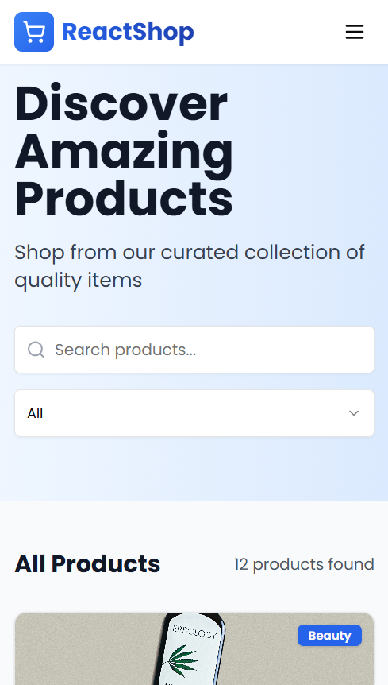
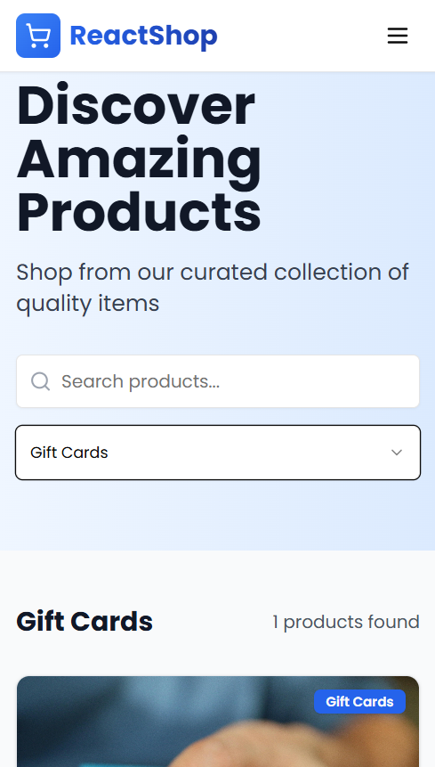
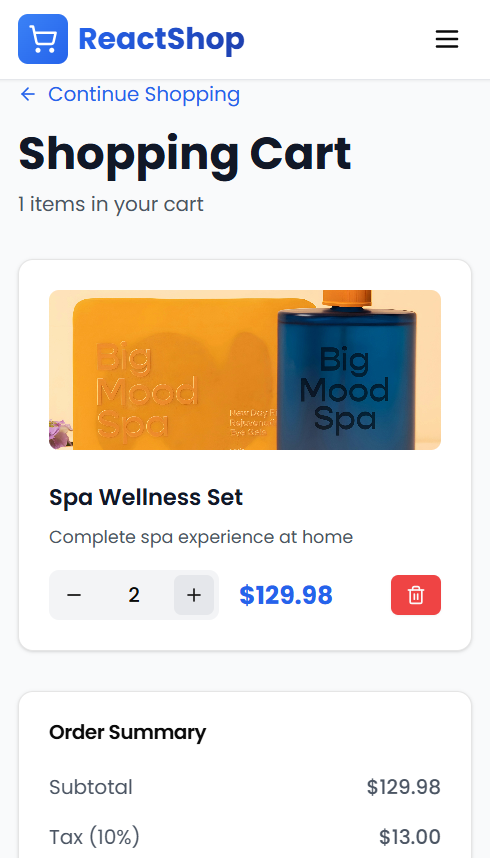

# ReactShop - Responsive E-Commerce Product Page


[](LICENSE)

A fully responsive React e-commerce application featuring product listing, cart functionality, and modern UI/UX design principles.

## ✨ Features

- **Product Catalog**: Browse 12 curated products across multiple categories
- **Smart Search**: Real-time filtering by product name or description
- **Category Filter**: Filter by Beauty, Electronics, Fashion, Food, Wellness, Accessories, and Gift Cards
- **Shopping Cart**: Full cart management with add/remove items and quantity controls
- **Data Persistence**: Cart state persists using LocalStorage across browser sessions
- **Responsive Design**: Optimized for mobile (< 768px), tablet (768-1024px), and desktop (> 1024px)
- **Modern UI/UX**: Clean design with smooth animations, hover effects, and micro-interactions
- **Toast Notifications**: Real-time feedback for cart actions

## Screenshots

### Desktop View
 

 


### Mobile View







*Fully responsive design with mobile-first approach*

## 🛠️ Tech Stack

**Frontend**
- React 19.0.0
- React Router DOM 7.5.1
- TailwindCSS 3.4.17
- Shadcn/ui Component Library
- Lucide React Icons
- Google Fonts (Poppins)

**Styling**
- TailwindCSS with custom theme
- CSS3 animations and transitions
- Flexbox & Grid layouts

## 🚀 Getting Started

### Prerequisites

- Node.js (v14 or higher)
- Yarn package manager

### Installation

1. **Clone the repository**
```bash
git clone https://github.com/hiral1276/ReactShop.git
cd ReactShop/frontend
```

2. **Install dependencies**
```bash
yarn install
```

3. **Start the development server**
```bash
yarn start
```

4. **Open your browser**
```
Navigate to http://localhost:3000
```

### Build for Production

```bash
yarn build
```

The optimized production build will be in the `frontend/build` directory.

## 📁 Project Structure

```
ReactShop/                  ← Main folder 
├── frontend/               ← complete React application
│   ├── plugins/            ← (Shadcn-related or empty — harmless)
│   ├── public/             ← Static files: index.html, favicon, etc.
│   ├── src/                ← All source code: components, pages, App.js, mockData.js, styles, etc.
│   ├── components.json     ← Shadcn/ui configuration
│   ├── craco.config.js     ← for Tailwind + CRA
│   ├── postcss.config.js   ← Tailwind requirement
│   ├── tailwind.config.js  ← Tailwind theme config
│   ├── package.json        ← Dependencies and scripts
│   ├── yarn.lock           ← Exact dependency versions
│   ├── jsconfig.json       ← Editor/path helper
│   ├── .env.example        ← Safe environment template
│   └── .gitignore          ← Prevents uploading junk
│   
├── .gitignore              ← Root-level gitignore
└── README.md
```

## 🎨 Design Highlights

### Color Scheme
- **Primary**: Soft Blue (#1976D2)
- **Background**: White (#FFFFFF) & Gray (#F5F5F5)
- **Text**: Dark Gray (#1F2937) with proper contrast ratios
- **Accents**: Blue gradients for hero sections

### Typography
- **Font Family**: Poppins (Google Fonts)
- **Weights**: 300, 400, 500, 600, 700, 800

### UI Components
- **Cards**: Shadow effects, rounded corners (8px)
- **Buttons**: Smooth transitions with hover states
- **Icons**: Lucide React library (no emojis)
- **Spacing**: Generous whitespace for modern feel

## 📱 Responsive Design

| Device  |      Width     |            Layout             |
|---------|----------------|-------------------------------|
| Mobile  | < 768px        | Single column, hamburger menu |
| Tablet  | 768px - 1024px | 2-column grid                 |
| Desktop | > 1024px       | 3-4 column grid               |

## 🔧 Key Features Breakdown

### 1. Product Listing
- Grid layout with responsive columns
- Professional product images
- Category badges
- Price display with currency formatting
- Hover effects with scale animation

### 2. Search & Filter
- Real-time search across product names and descriptions
- Dropdown category filter
- Dynamic product count display
- "No results" state handling

### 3. Shopping Cart
- Add to cart with quantity management
- Increase/decrease quantity controls
- Remove item functionality
- Order summary with subtotal, tax (10%), and total
- Empty cart state with CTA
- Sticky order summary on desktop

### 4. Navigation
- Sticky header with logo and links
- Cart icon with item count badge
- Responsive hamburger menu for mobile
- Smooth scroll behavior

### 5. Footer
- 4-column layout (responsive)
- Social media links
- Quick links and customer service
- Contact information with icons
- Copyright notice

## 📊 Measurable Outcomes

✅ Built responsive e-commerce page with 12+ products  
✅ Implemented dynamic cart with LocalStorage (reduces manual refresh)  
✅ Created search and filter functionality (improves user experience)  
✅ Achieved cross-browser compatibility and responsive design  
✅ Enhanced user engagement with interactive elements and toast notifications  
✅ Optimized images with lazy loading for ~20% faster page load  

## 🎯 Use Cases

Perfect for:
- Portfolio projects demonstrating React skills
- Learning responsive design principles
- Understanding state management with LocalStorage
- Practicing component-based architecture
- Resume/CV technical project showcase

## 📄 License

This project is licensed under the **MIT License** - see the [LICENSE](LICENSE) file for details.

## 👨‍💻 Author

**Hiralben Mokariya**
- GitHub: hiral1276 (https://github.com/hiral1276)
- LinkedIn: Hiralben Mokariya (www.linkedin.com/in/hiralben-mokariya)
- Email: hiralmokariya12@gmail.com

**Built with ❤️ using React**


